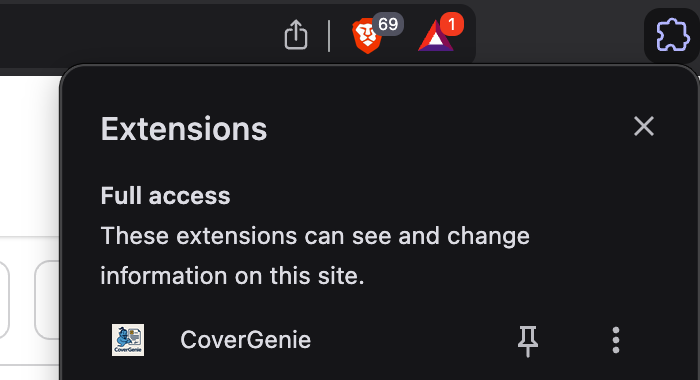
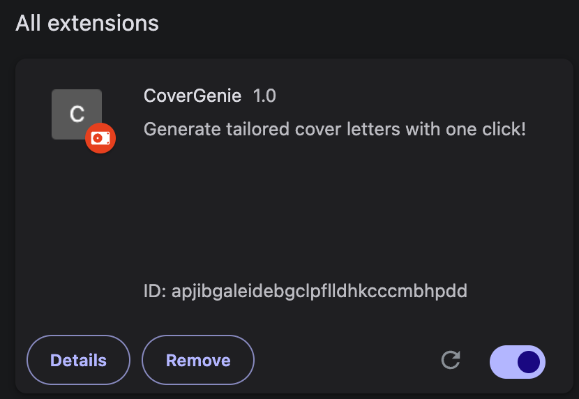
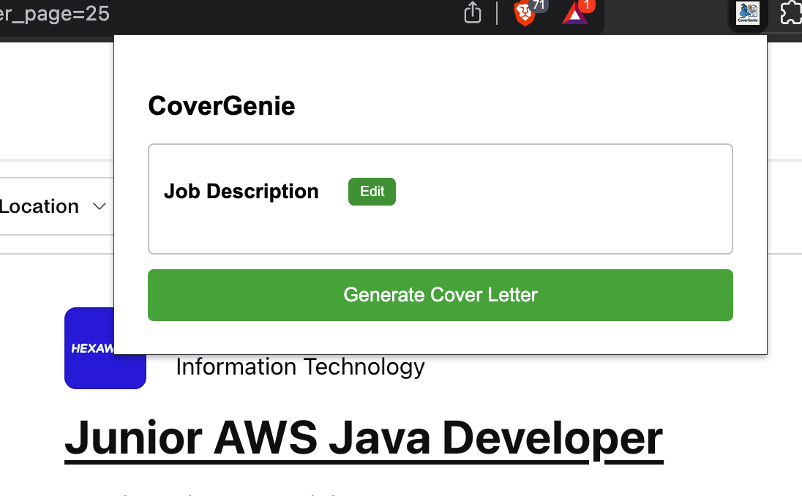
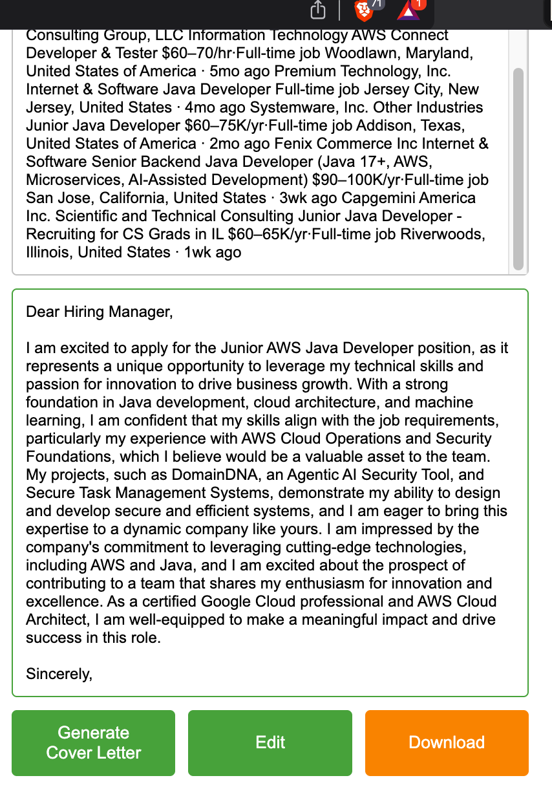

# CoverGenie

CoverGenie is a Chrome extension that automatically generates personalized cover letters using AI. It extracts job descriptions from LinkedIn and generates tailored cover letters using Groq's Llama model.

## Features

- One-click cover letter generation from LinkedIn job postings
- Editable cover letter content
- Professional formatting with Times New Roman, 12pt font
- Download as Microsoft Word (.docx) document
- Real-time editing of both job description and cover letter
- Powered by Groq's Llama 3.3 70B model for high-quality content
- Advanced prompt engineering for personalized cover letters

## Prerequisites

- Python 3.9 or higher
- Chrome browser
- Groq API key (get one at [https://console.groq.com](https://console.groq.com))

## Installation

1. Clone the repository:
```bash
git clone https://github.com/aakashgangji/covergenie.git
cd covergenie
```

2. Install Python dependencies:
```bash
pip install -r requirements.txt
```

3. Configure Groq API key:
   - Create a `.env` file in the root directory of the project
   - Add your Groq API key to the `.env` file:
   ```bash
   GROQ_API_KEY=your-groq-api-key-here
   ```
   - The `.env` file is already in `.gitignore` and will not be committed to the repository

4. Load the Chrome extension:
   - Open Chrome and go to `chrome://extensions/`
      
      

   - Enable "Developer mode"
      

   - Click "Load unpacked"
   - Select the `extension` folder from the project
      


## Usage

1. Start the backend server:
```bash
# Make sure you're in the root directory of the project (where you can see both backend/ and resume/ folders)
uvicorn backend.main:app --reload
```

2. Navigate to a Handshake job posting
3. Click the CoverGenie extension icon
4. Click "Generate Cover Letter"
  
5. Edit the generated cover letter if needed
  
6. Click "Download" to save as a .docx file

## Project Structure

```
covergenie/
├── backend/
│   ├── main.py              # FastAPI server
│   └── utils/
│       ├── ollama.py        # Groq API integration
│       ├── parser.py        # Text cleaning utilities
│       └── prompt_builder.py # Cover letter prompt generation
├── extension/
│   ├── manifest.json        # Chrome extension manifest
│   ├── popup.html          # Extension popup UI
│   ├── popup.js            # Frontend logic
│   └── content.js          # Job description extraction
├── resume/
│   └── resume_data.json    # User's resume data for personalization
└── requirements.txt         # Python dependencies
```

## Recent Updates

### Document Format Changes
- Switched from .txt to .docx format for better compatibility
- Added professional formatting:
  - Times New Roman font
  - 12-point font size
  - Standard paragraph formatting

### Groq API Integration
- Migrated from Ollama/Mistral to Groq's cloud API
- Uses Llama 3.3 70B Versatile model for high-quality cover letter generation
- Implements retry mechanism for reliability
- Advanced prompt engineering with structured resume formatting
- Improved personalization by matching candidate qualifications with job requirements

## Contributing

1. Fork the repository
2. Create your feature branch (`git checkout -b feature/AmazingFeature`)
3. Commit your changes (`git commit -m 'Add some AmazingFeature'`)
4. Push to the branch (`git push origin feature/AmazingFeature`)
5. Open a Pull Request


## Acknowledgments

- [Groq](https://groq.com) for providing the AI model API
- [FastAPI](https://fastapi.tiangolo.com/) for the backend framework
- [python-docx](https://python-docx.readthedocs.io/) for document generation

